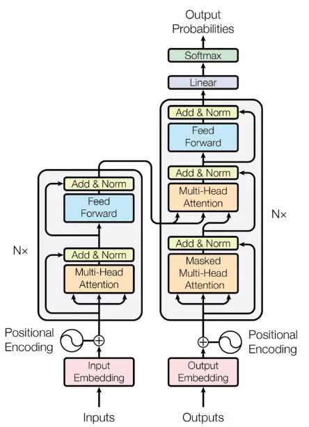
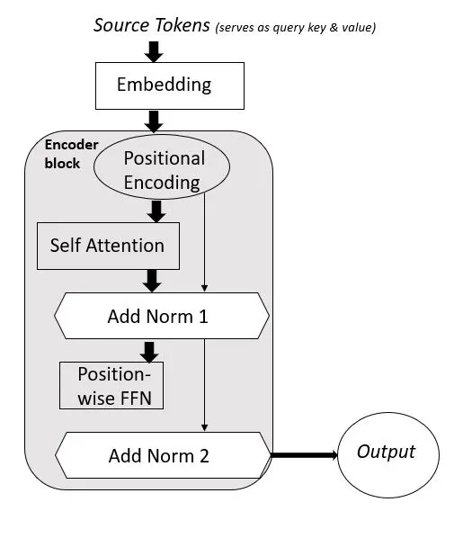
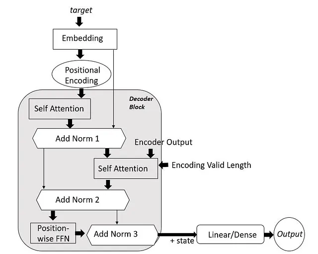

# Text-Summarization-with-PyTorch-Transformer-Model
Text summarization in NLP plays a crucial role in Efficient Consumption, Preserving Vital Information, enhanced Communication and Timesaving. Which in summary, improves efficiency, comprehension, and communication by distilling large texts into concise, meaningful summaries.

# Transformer Building

Building a transformer model which is in fact the building block of sophisticated models in NLP(Natural Language Processing) and Machine Learning like BERT, GPT and more. There are two parts to the transformer:
    
* Encoder: 
    The Encoder is made up of multiple similar blocks where there are two main sublayers, the self-attention pooling layer and a position wise feed forward network.
        
    Since this is a deep architecture, ResNet design has been employed here, where residual connections are added to both sub layers. Resnet is basically a collection of nested function classes, where the larger function classes contain the smaller ones that increases the expressive power of the network by training them to the identity function f(x) = x. In fact each additional nested layer should more easily contain the identity function as one of it’s elements.
        
    Resnet addresses the vanishing gradient problem and also allows shortcut connections within the network, that addresses information loss, since every layer linearly transforms the input which results in some distortion of information.
        
    In ResNet we basically try to adjust the weights so that (f(x) — x) gets closer to 0 (i.e. we try to calculate the residual, hence the name).
        
    In a particular encoder block, the queries, keys and values are from the previous block. For the first block, the original input tokens are embedded, then positional encodings are added to each token and fed into the first block for processing. The position wise feed forward network transforms the representation at all sequence positions using the same Multi layered perceptron (MLP) and hence using the same weight parameters. A ReLU activation employed here adds some non-linearity and helps in modeling complex relationships between tokens.

    Transformer Architecture as depicted in the original 2017 paper “Attention is All You Need” by Vaswani et al.

    After the residual connection is added, layer normalization has been done. This is done because the magnitude of parameters in one layer can widely differ from the other layer. Therefore, the difference in magnitude of outputs of the connected layers will also be varied, therefore normalization along each row is done to adjust that .The flowchart of how the encoder works is shown in the diagram below.

* The Decoder:
    The decoder layer of the transformer model is almost similar to the encoder with one extra attention layer where the output of the previous decoder layer serves as the query and the encoder outputs serve as the key and the values.
        
    First, the target tokens are embedded and a positional encoding is added to them.
        
    Next they are made to pass through an n-block layered structure where each block does the following. As in encoder, self attention is applied to the encoded tokens and as per the Resnet design. Here the attention mechanism is termed as masked self attention model, because, though during training the model has the tokens for all the positions, but during prediction phase, it will have only the tokens generated so far. 
        
    Therefore a decoder valid length needs to be passed and based on that, the tokens need to be masked. The outputs of the self-attention layer along with the encoded outputs are passed through the AddNorm layer.
        
    Next, a second self-attention layer accepts the input as query from the previous layer along with the encoder output as keys and values and encoding valid length for masking function. 
        
    The output along with the output from the first attention layer is passed through the second Addnorm layer. 
        
    After that, the feed forward network translates the output of the second add norm layer. 
        
    The original output of the second Add norm along with the output of feed forward layer is passed through the final Add norm layer. 
        
    The output of the final layer of the block along with the state information is passed to the subsequent decoding blocks for further processing. 
        
    The output of the last decoder block is made to pass through a dense (linear as in Pytorch) to obtain the outputs. The flowchart of the working of decoder is shown as below. 

